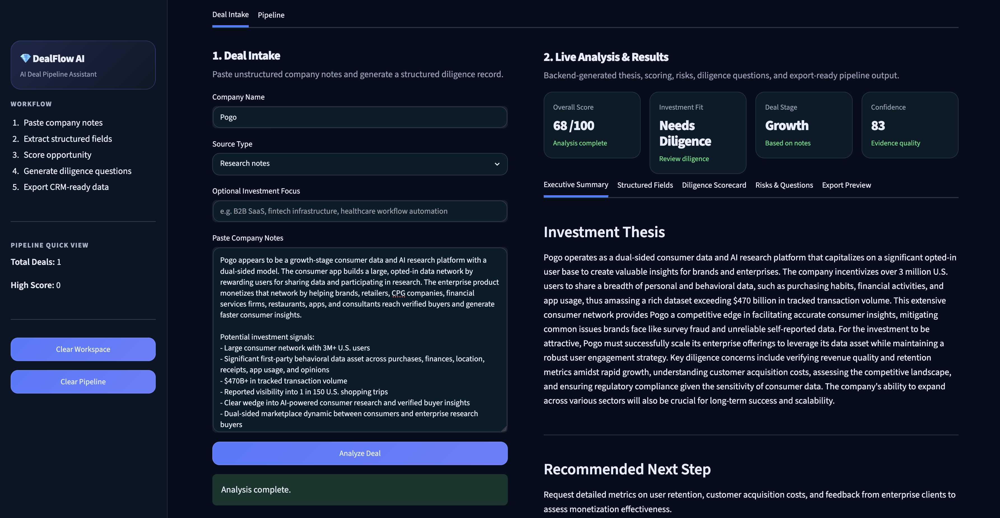
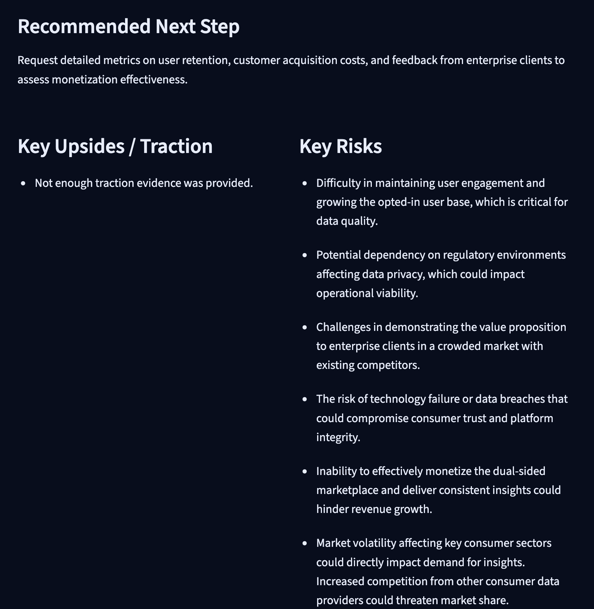

# DealFlow AI — AI Deal Pipeline Assistant

DealFlow AI is a deployed Streamlit app that converts unstructured company notes into structured investment analysis, opportunity scoring, inferred risks, diligence questions, and CRM-ready pipeline exports.

**Live Demo:** Private Streamlit Cloud app available upon request.

---

## Screenshots

### Investment Thesis & Summary



### Risks & Questions



---

## Key Features

- Deal intake for unstructured company notes
- AI-generated investment thesis
- Structured company fields
- Opportunity score and confidence score
- Priority rating
- Inferred risks
- Diligence questions
- Session-based pipeline tracking
- CRM-ready CSV export

---

## Example Use Case

A user pastes notes about a private company into the app. DealFlow AI returns a structured investment record with thesis, risks, diligence questions, scores, and exportable pipeline data.

This can support workflows such as venture sourcing, startup research, private market screening, CRM pipeline preparation, initial investment memo drafting, and analyst workflow automation.

---

## Tech Stack

- Python
- Streamlit
- OpenAI API
- OpenAI Agents SDK
- Pandas
- Pydantic
- python-dotenv

---

## Local Setup

Clone the repository:

```bash
git clone https://github.com/robtabamo9292/ai-deal-pipeline-assistant.git
cd ai-deal-pipeline-assistant
```


Create and activate a virtual environment:


```bash

python -m venv .venv

source .venv/bin/activate

```


Install dependencies:


```bash

pip install -r requirements.txt

```


Create a `.env` file:


```bash

OPENAI_API_KEY=your_api_key_here

```


Run the app:


```bash

python -m streamlit run app.py

```


---


## Notes on AI Output


DealFlow AI is designed to assist with early-stage research and diligence organization. It does not replace investment judgment. Outputs should be reviewed, verified, and supplemented with primary source diligence, financial data, customer references, and market research.


---


## Project Status


The app is deployed and functional. Current capabilities include deal intake, AI-generated analysis, risk inference, scorecard generation, pipeline tracking, and CSV export.
