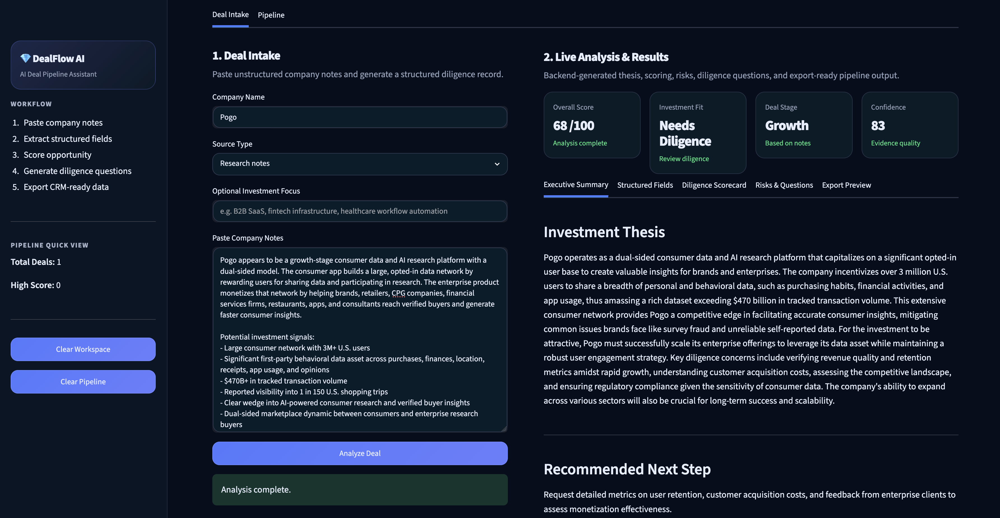
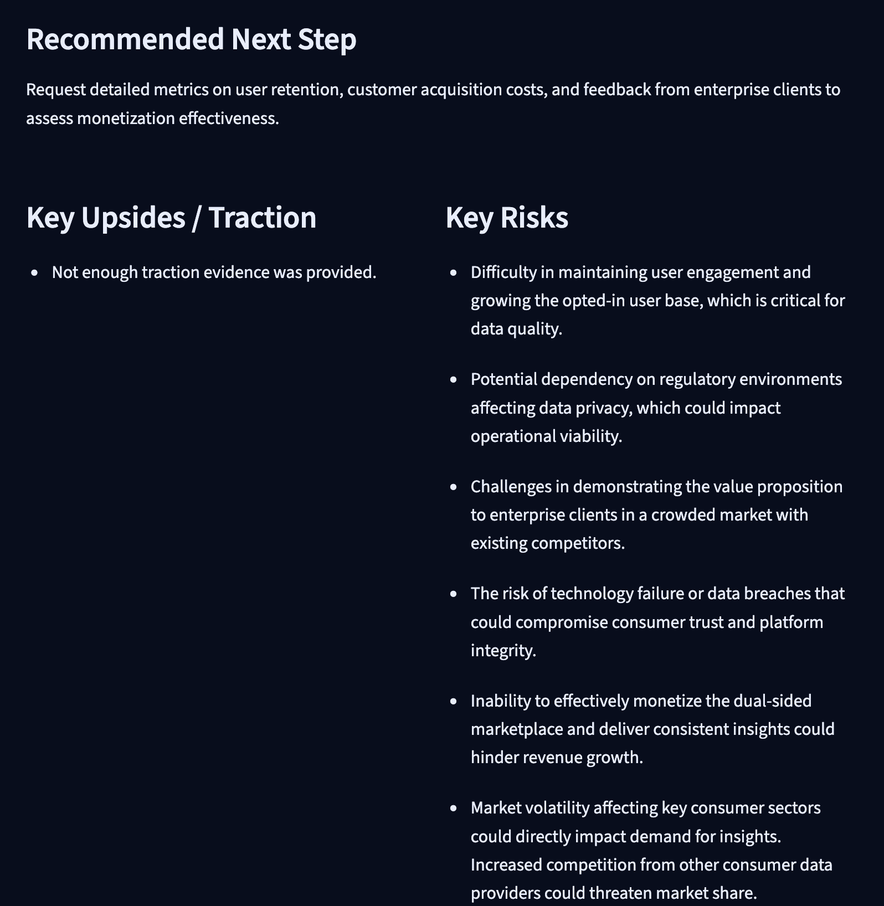
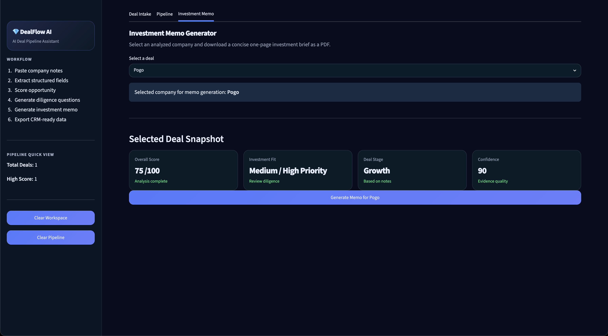
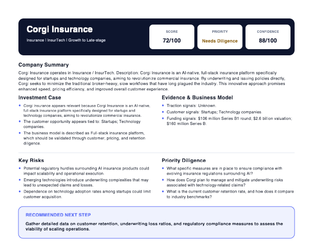
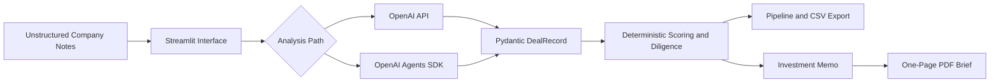

# DealFlow AI — AI Deal Pipeline Assistant

DealFlow AI is a Streamlit application that converts unstructured company notes into structured investment analysis, opportunity scoring, diligence questions, pipeline records, and a downloadable one-page investment brief.

The project demonstrates an end-to-end AI workflow for venture sourcing, private-market screening, analyst research, and CRM preparation.

Private Streamlit Cloud access is available upon request.

---

## Product Workflow

1. Paste unstructured company or founder notes.
2. Extract structured company and investment fields.
3. Evaluate evidence quality and opportunity fit.
4. Generate risks and priority diligence questions.
5. Add the company to a session-based pipeline.
6. Generate and download a one-page PDF investment brief.
7. Export pipeline data as a CRM-ready CSV file.

---

## Screenshots

### Investment Analysis



### Risks and Diligence Questions



### Investment Memo Deal Snapshot



### Downloadable Investment Brief



---

## Key Features

- Unstructured company-note intake
- AI-generated company and investment summaries
- Structured fields validated with Pydantic
- Opportunity and confidence scoring
- Priority classification
- Evidence-based diligence scorecard
- Inferred risks and targeted diligence questions
- Session-based deal pipeline
- CRM-ready CSV export
- One-page investment memo generation
- Downloadable PDF investment brief
- Standard OpenAI API analysis workflow
- Optional OpenAI Agents SDK workflow
- Fallback record generation when AI analysis is unavailable
- Automated tests and GitHub Actions validation

---

## Architecture


```mermaid
flowchart LR
    A[Unstructured Company Notes] --> B[Streamlit Interface]
    B --> C{Analysis Path}
    C --> D[OpenAI API]
    C --> E[OpenAI Agents SDK]
    D --> F[Pydantic DealRecord]
    E --> F
    F --> G[Deterministic Scoring and Diligence]
    G --> H[Pipeline and CSV Export]
    G --> I[Investment Memo]
    I --> J[One-Page PDF Brief]
```

The language model extracts and organizes information from the source notes. Deterministic Python functions then apply scoring rules, calculate confidence, assign priority, and build the diligence scorecard.

---

## Example Use Case

An analyst pastes notes collected from a founder conversation, company website, pitch deck, or sourcing process.

DealFlow AI produces:

- Structured company information
- Investment thesis
- Market, traction, customer, and funding signals
- Opportunity and confidence scores
- Priority classification
- Key risks
- Priority diligence questions
- Recommended next steps
- Pipeline-ready data
- A concise PDF investment brief

The output can support venture sourcing, startup research, private-market screening, initial memo preparation, and CRM pipeline organization.

---

## Tech Stack

- Python
- Streamlit
- OpenAI API
- OpenAI Agents SDK
- Pydantic
- Pandas
- ReportLab
- python-dotenv
- Pytest
- GitHub Actions

---

## Local Setup

Clone the repository:

```bash
git clone https://github.com/robtabamo9292/ai-deal-pipeline-assistant.git
cd ai-deal-pipeline-assistant
```

Create and activate a virtual environment:

```bash
python -m venv .venv
source .venv/bin/activate
```

Install application dependencies:

```bash
python -m pip install -r requirements.txt
```

Create your local environment file:

```bash
cp .env.example .env
```

Add your OpenAI API key to `.env`:

```env
OPENAI_API_KEY=your_api_key_here
OPENAI_MODEL=gpt-4o-mini
OPENAI_AGENT_MODEL=gpt-4o-mini
```

Run the application:

```bash
python -m streamlit run app.py
```

The local application is normally available at:

```text
http://localhost:8501
```

---

## Tests

Install development dependencies:

```bash
python -m pip install -r requirements-dev.txt
```

Run the test suite:

```bash
python -m pytest -q
```

The automated tests cover:

- Agents SDK tool registration
- Priority classification thresholds
- Score boundaries
- Investment memo generation
- Pipeline export structure
- PDF creation
- Fallback company extraction

GitHub Actions also compiles the Python files and runs the test suite on pushes and pull requests.

---

## Repository Structure

```text
.
├── app.py
├── src/
│   ├── agent_workflow.py
│   ├── export.py
│   ├── llm.py
│   ├── memo.py
│   ├── memo_pdf.py
│   ├── memo_schema.py
│   ├── sample_data.py
│   ├── schema.py
│   └── scoring.py
├── tests/
│   └── test_core.py
├── assets/
│   └── screenshots/
├── archive/
│   └── legacy_ui/
├── requirements.txt
├── requirements-dev.txt
└── .github/
    └── workflows/
        └── tests.yml
```

The `archive/legacy_ui` directory contains an earlier interface prototype retained only as historical implementation reference. It is not used by the current application.

---

## Privacy and Limitations

- Notes submitted through an enabled AI workflow are sent to the configured OpenAI service for analysis.
- Do not enter confidential, regulated, or personally identifiable information without appropriate authorization.
- Output quality depends on the completeness and accuracy of the source notes.
- Scores are screening aids, not investment recommendations.
- The application does not independently verify company claims, financial figures, funding rounds, customers, or market data.
- The current pipeline is session-based and is not a permanent CRM or database.
- CSV output is CRM-ready, but the application does not directly synchronize with a CRM.
- All generated analysis should be reviewed against primary sources and professional judgment.

---

## Project Status

The application is functional and includes deal intake, structured extraction, AI-assisted analysis, deterministic scoring, diligence generation, session-based pipeline tracking, CSV export, investment memo generation, and one-page PDF export.

Automated tests and continuous integration are included to validate the core workflow.
