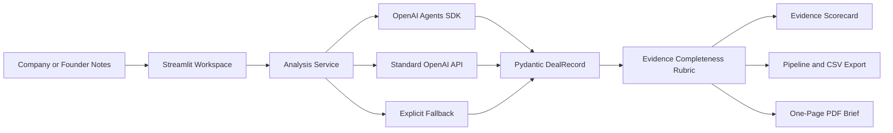

# DealFlow AI — Private-Market Diligence Workspace

DealFlow AI is a Streamlit application that converts unstructured company notes into structured diligence evidence, prioritized information gaps, CRM-ready pipeline records, and a downloadable one-page investment brief.

The project demonstrates an end-to-end AI workflow for venture sourcing, private-market screening, analyst research, and business-operations automation.

## Product workflow

1. Load a sample company or paste unstructured notes.
2. Extract structured company, customer, traction, funding, risk, and business-model evidence.
3. Measure diligence evidence completeness across nine categories.
4. Identify the weakest evidence areas and generate targeted diligence questions.
5. Add the company to a session-based pipeline.
6. Export CRM-ready CSV data or a one-page PDF brief.

## Important scoring distinction

The displayed score is an **evidence-completeness score**. It measures how much decision-useful diligence information is present in the submitted notes.

It does **not** measure investment quality, expected returns, valuation attractiveness, or the probability that a company will succeed.

The deterministic rubric evaluates documented evidence across:

- Founder and team
- Market
- Product and differentiation
- Traction and product-market-fit evidence
- Customer and ICP clarity
- Business model and unit economics
- Go-to-market evidence
- Competition
- Material risks

Missing evidence receives zero points. The scoring method is documented and evaluated against a set of complete, partial, minimal, negative, and risk-heavy examples.

## Key features

- Unstructured company-note intake
- Public sample mode using built-in demonstration companies
- Standard OpenAI and optional OpenAI Agents SDK analysis paths
- Pydantic-validated structured records
- Deterministic evidence-completeness scorecard
- Explicit analysis-path, model, fallback, prompt-version, and timestamp metadata
- Targeted diligence questions based on evidence gaps
- Session-based deal pipeline
- CRM-ready CSV export
- Institutional one-page PDF investment brief
- Deterministic evaluation set and results
- Mocked AI and failure-path tests
- Ruff linting and GitHub Actions CI

## Architecture


```mermaid
flowchart LR
    A[Company or Founder Notes] --> B[Streamlit Workspace]
    B --> C[Analysis Service]
    C --> D[OpenAI Agents SDK]
    C --> E[Standard OpenAI API]
    C --> F[Explicit Fallback]
    D --> G[Pydantic DealRecord]
    E --> G
    F --> G
    G --> H[Evidence Completeness Rubric]
    H --> I[Evidence Scorecard]
    H --> J[Pipeline and CSV Export]
    H --> K[One-Page PDF Brief]
```

The language model extracts and organizes information. Python then applies a transparent evidence rubric. AI execution provenance is retained so users can see which path produced the record and whether fallback logic was used.

## Public sample mode

The app includes built-in sample notes for public demonstration. A fictional healthcare workflow company is included so users can test the full workflow without relying on confidential company information.

The public samples are demonstrations, not verified investment research.

## Local setup

```bash
git clone https://github.com/robtabamo9292/ai-deal-pipeline-assistant.git
cd ai-deal-pipeline-assistant
python -m venv .venv
source .venv/bin/activate
python -m pip install -r requirements.txt
cp .env.example .env
python -m streamlit run app.py
```

Add your API key and preferred models to `.env`:

```env
OPENAI_API_KEY=your_api_key_here
OPENAI_MODEL=gpt-4o-mini
OPENAI_AGENT_MODEL=gpt-4o-mini
```

When no API key is configured, the application uses an explicitly labeled deterministic fallback record instead of presenting the result as AI-generated.

## Tests and evaluation

Install development dependencies:

```bash
python -m pip install -r requirements-dev.txt
```

Run linting, tests, and the deterministic evaluation:

```bash
python -m ruff check app.py src tests eval
python -m pytest -q
python -m eval.run_eval
```

The automated test suite covers:

- Evidence-score boundaries and status bands
- Zero-evidence behavior
- Negative traction evidence
- Pydantic validation
- JSON extraction and malformed responses
- Missing API-key fallback behavior
- Mocked OpenAI output
- Agents SDK failure and fallback routing
- Export provenance fields
- PDF generation

The evaluation set contains ten labeled examples spanning complete, partial, minimal, negative, team-only, traction-only, economics-heavy, and risk-heavy notes. Current expected cases pass the deterministic rubric.

## Repository structure

```text
.
├── app.py
├── src/
│   ├── analysis_service.py
│   ├── agent_workflow.py
│   ├── export.py
│   ├── llm.py
│   ├── memo.py
│   ├── memo_pdf_v2.py
│   ├── memo_schema.py
│   ├── sample_data.py
│   ├── schema.py
│   ├── scoring.py
│   └── ui/
│       ├── components.py
│       └── styles.py
├── tests/
│   └── test_core.py
├── eval/
│   ├── eval_set.csv
│   ├── eval_results.csv
│   └── run_eval.py
├── data/
│   ├── sample_inputs.csv
│   └── sample_outputs.csv
├── requirements.txt
├── requirements-dev.txt
├── pyproject.toml
└── .github/workflows/tests.yml
```

## Privacy and limitations

- Notes submitted through an enabled AI path are sent to the configured OpenAI service.
- Do not submit confidential, regulated, or personally identifiable information without authorization.
- The application does not independently verify claims, financial figures, customers, funding rounds, or market data.
- The evidence score measures documentation completeness, not company quality.
- Extraction confidence measures record completeness, not factual truth.
- The current pipeline is session-based and is not a permanent CRM or database.
- All generated analysis requires human review and primary-source diligence.

## Project status

The application is functional and includes structured extraction, explicit fallback handling, evidence scoring, diligence generation, public samples, pipeline tracking, CSV export, PDF briefing, automated tests, deterministic evaluation, linting, and continuous integration.
